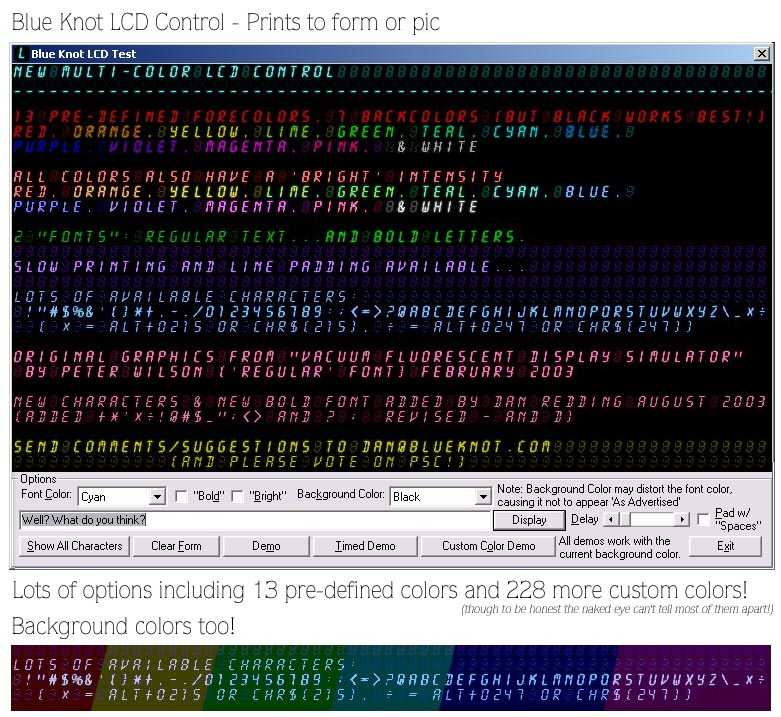



## Multi\-color LCD Control \(Blue Knot\)

### Description

Alphanumeric LCD Control with multiple foreground and background colors, fast or slow printing, option to pad lines with 'spaces'. Regular & Bold 'font', 2 levels of brightness. 13 pre-defined background colors (or 240 custom) and 7 background colors.

Inspired by Peter Wilson's "Vacuum Fluorescent Display Simulator" (In fact I based the 'regular' graphics on his graphics.) Some characters added/redone and new 'bold' font. Colors tinted at runtime, not pre-made (for size and flexibility).

Also adapted a bit of code by Kamilche (Load picture from byte array) to load JPGs directly from the resource file.

Enjoy the code, and please comment/vote.
 
### More Info
 

             |
---                |---
**Submitted On**   |2003-09-01 07:20:50
**By**             |[Dan Redding \- Blue Knot Software](https://github.com/Planet-Source-Code/PSCIndex/blob/master/ByAuthor/dan-redding-blue-knot-software.md)
**Level**          |Intermediate
**User Rating**    |5.0 (15 globes from 3 users)
**Compatibility**  |VB 5\.0, VB 6\.0
**Category**       |[Custom Controls/ Forms/  Menus](https://github.com/Planet-Source-Code/PSCIndex/blob/master/ByCategory/custom-controls-forms-menus__1-4.md)
**World**          |[Visual Basic](https://github.com/Planet-Source-Code/PSCIndex/blob/master/ByWorld/visual-basic.md)
**Archive File**   |[Multi\-colo163900912003\.zip](https://github.com/Planet-Source-Code/dan-redding-blue-knot-software-multi-color-lcd-control-blue-knot__1-48147/archive/master.zip)

